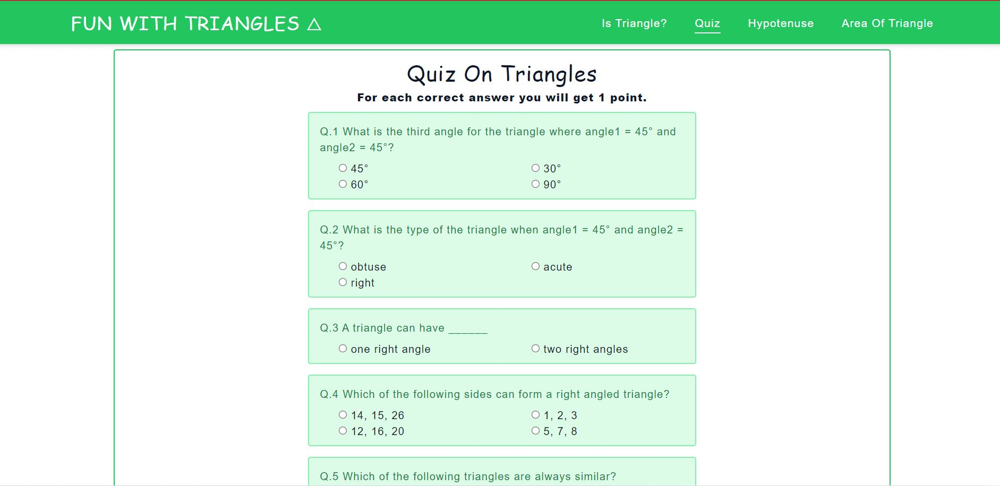

# Mark-12 Fun With Triangles

A website which helps you to learn about triangles.

## [Live Link](https://neog-fun-with-triangles.vercel.app/)

## Tech Used

- HTML
- CSS
- JS

Following are the sections of our app:

## Is Triangle?

- Given 3 angles, app calculates whether that angle forms a triangle or not.
- Error msgs to user if
  - Any input is empty OR any input is zero OR -ve.
- Clicking Clear button empties all input fields,empties the output.
- **(Additional feature)** If you click input with output showing for previous inputs, we assume you are changing the inputs, so we clear down the output.
- **(Additional feature)** If angle given to inputs are greater than 360deg we find its reference angle, for example lets consider 400 degree we convert it to 40 degree (reference angle). For more info, see this [image](https://useruploads.socratic.org/K5tA9ZP0Tv2tdzuHyRDY_refer%20angle%20400.png).
- Output highlighted with red or green depending triangle forms or not.

## Quiz

- Select your answers from all the questions and click "Submit" button to know your score.
- Clicking Clear button unselects all radio buttons & empties the output box.
- Output highlighted with red or green depending whether your score is above 5 or not.
- **(Additional feature)** Navbar gets fixed on scrolling down and gets back to its original position when you reach the top.

## Hypotenuse

- Enter the base value, height value to get the hypotenuse.
- We are using hypotenuse formula to calculate the hypotenuse.
- Error msgs to user if
  - Any input is empty, -ve or zero.
- Clicking Clear button empties all input fields,empties the output.
- **(Additional feature)** If you click input with output showing for previous inputs, we assume you are changing the inputs, so we clear down the output.

## Area of triangle

- Enter the lengths of all 3 sides of a triangle, we'll claculate the area of that triangle.
- Error msgs to user if
  - Any input is empty, -ve or zero.
- Clicking Clear button empties all input fields,empties the output.
- **(Additional feature)** If you click input with output showing for previous inputs, we assume you are changing the inputs, so we clear down the output.
- Output shown with red or green depending whether your lengths form a triangle or not, if forms a triangle, output containing area of triangle is shown with green color.

